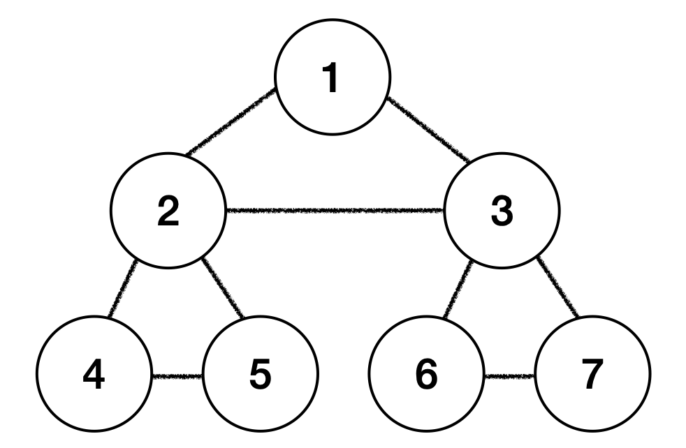
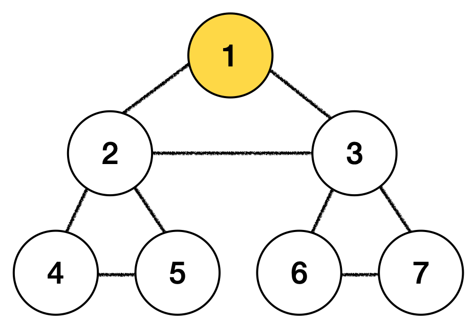
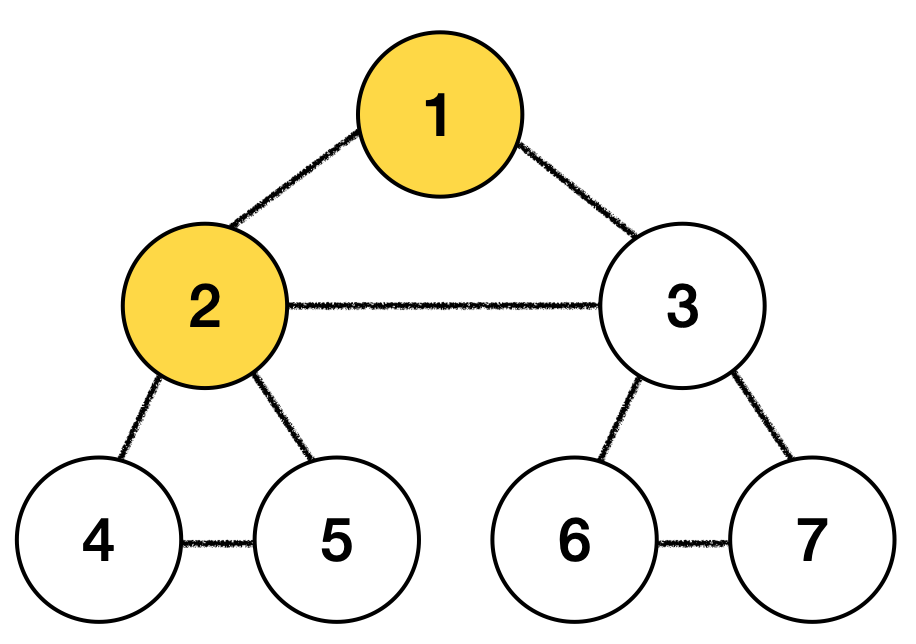
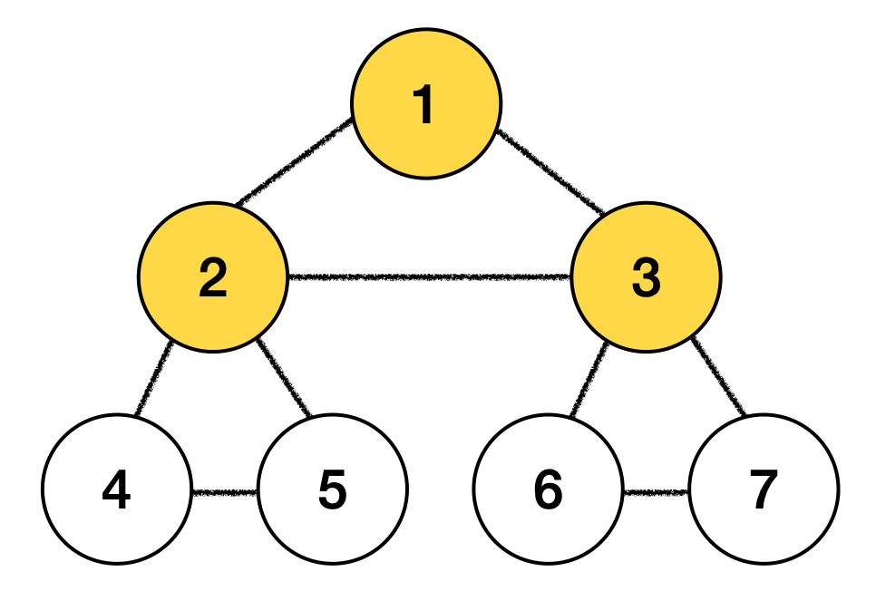
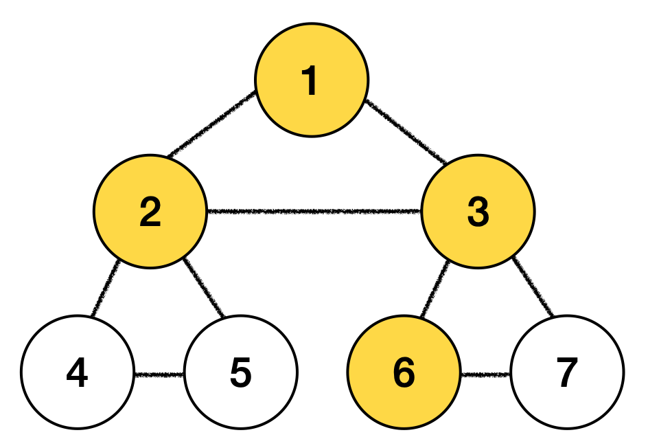
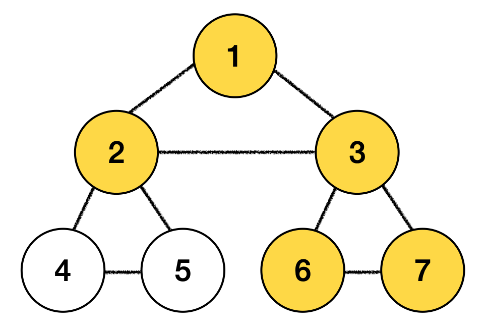
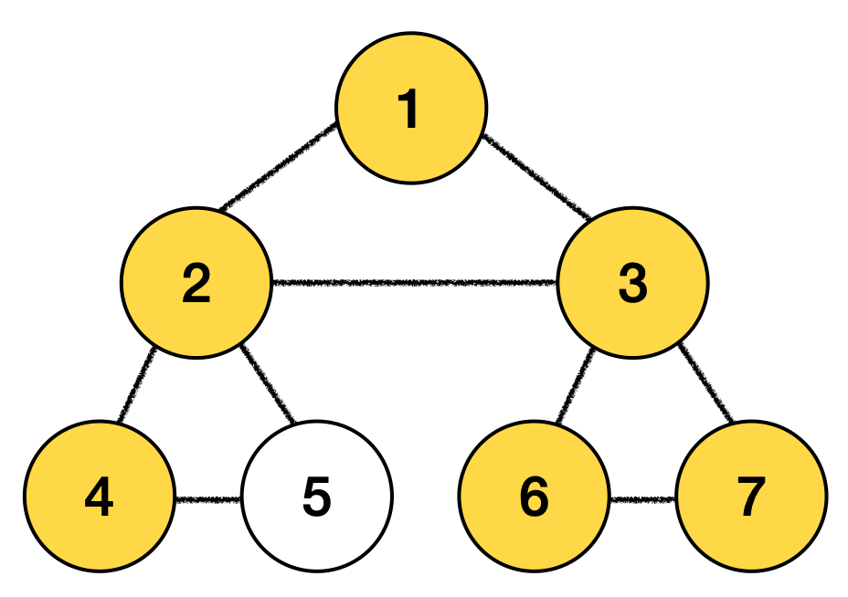
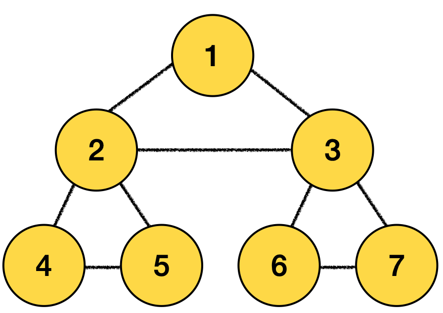

### 깊이 우선 탐색(Depth First Search, DFS)

1\. 맹목적 탐색 방법(이미 정해진 순서에 따라 상태 공간 그래프를 점차 형성해 가면서 해를 탐색하는 방법)의 하나<br>
2\. 스택을 이용하여 접근

<br><br>

### 탐색 방법

- 스택 최상단 노드 확인
- 최상단 노드에게 방문하지 않은 인접 노드가 있으면 그 노드를 스택에 넣고 방문처리, 없으면 스택 최상단 노드를 pop

<br><br>

### 예시
- 초기상태
  - 스택 : ]
  - 방문노드 : 
  
- 시작 : 시작 노드를 스택에 삽입 및 방문처리
  - 스택 : 1 ]
  - 방문노드 : 1
  
- 방문 1 : 스택의 최상단 노드 1의 인접한 노드 중 방문하지 않은 노드 2를 스택에 삽입
  - 스택 : 2 1 ]
  - 방문노드 : 1 2 
  
- 방문 2 : 노드 2의 인접 노드 중 방문하지 않은 노드 3을 스택에 삽입
  - 스택 : 3 2 1]
  - 방문노드 : 1 2 3
  
- 방문 4 : 노드 3의 인접 노드 중 방문하지 않은 노드 6을 스택에 삽입
  - 스택 : 6 3 2 1]
  - 방문노드 : 1 2 3 6
  
- 방문 5 : 노드 6의 인접 노드 중 방문하지 않은 노드 7을 스택에 삽입
  - 스택 : 7 6 3 2 1]
  - 방문노드 : 1 2 3 6 7
  
- 7, 6, 3 노드의 인접 노드는 전부 방문했으므로 스택에서 pop, 2번 노드의 인접 노드 4번 노드를 스택에 삽입
  - 스택 : 4 2 1]
  - 방문노드 : 1 2 3 6 7 4
  
- 방문 6 : 노드 4의 인접 노드 중 방문하지 않은 노드 5를 스택에 삽입
  - 스택 : 5 4 2 1]
  - 방문노드 : 1 2 3 6 7 4 5
  
- 모든 노드가 방문처리됨, 스택에 남아있는 노드들을 꺼내줌

<br><br>

### 소스코드

1\. Graph.java
```java
import java.util.Iterator;
import java.util.LinkedList;

public class Graph {
    private int V; // 노드의 개수
    private LinkedList<Integer> adj[]; // 인접 리스트

    Graph(int v) {
        V = v;
        adj = new LinkedList[v];
        for (int i = 0; i < v; ++i) // 인접 리스트 초기화
            adj[i] = new LinkedList();
    }

    // 노드를 연결 v->w
    void addEdge(int v, int w) {
        adj[v].add(w);
    }

    /** DFS에 의해 사용되는 함수 */
    void DFSUtil(int v, boolean visited[]) {
        // 현재 노드를 방문한 것으로 표시하고 값을 출력
        visited[v] = true;
        System.out.print(v + " ");

        // 방문한 노드와 인접한 모든 노드를 가져온다.
        Iterator<Integer> i = adj[v].listIterator();
        while (i.hasNext()) {
            int n = i.next();
            // 방문하지 않은 노드면 해당 노드를 시작 노드로 다시 DFSUtil 호출
            if (!visited[n])
                DFSUtil(n, visited); // 순환 호출
        }
    }

    /** 주어진 노드를 시작 노드로 DFS 탐색 */
    void DFS(int v) {
        // 노드의 방문 여부 판단 (초깃값: false)
        boolean visited[] = new boolean[V];

        // v를 시작 노드로 DFSUtil 순환 호출
        DFSUtil(v, visited);
    }

    /** DFS 탐색 */
    void DFS() {
        // 노드의 방문 여부 판단 (초깃값: false)
        boolean visited[] = new boolean[V];

        // 비연결형 그래프의 경우, 모든 정점을 하나씩 방문
        for (int i=0; i<V; ++i) {
            if (visited[i] == false)
                DFSUtil(i, visited);
        }
    }
}
```
2\. Solution.java
```java
public class Solution {

    public static void main(String[] args) {

        Graph graph = new Graph(7);

        // 1번 노드 연결
        graph.addEdge(0, 1);
        graph.addEdge(0, 2);
        // 2번 노드 연결
        graph.addEdge(1, 0);
        graph.addEdge(1, 2);
        graph.addEdge(1, 3);
        graph.addEdge(1, 4);
        // 3번 노드 연결
        graph.addEdge(2, 0);
        graph.addEdge(2, 1);
        graph.addEdge(2, 5);
        graph.addEdge(2, 6);
        // 4번 노드 연결
        graph.addEdge(3, 1);
        graph.addEdge(3, 4);
        // 5번 노드 연결
        graph.addEdge(4, 3);
        // 6번 노드 연결
        graph.addEdge(5, 2);
        graph.addEdge(5, 6);
        // 7번 노드 연결
        graph.addEdge(6, 2);
        graph.addEdge(6, 5);

        // DFS 수행
        graph.DFS(0); // 0번 노드를 시작 노드로 DFS 탐색
        // graph.DFS(); // 비연결형 그래프일때 사용
    }
}
// 출력결과 : 0 1 2 5 6 3 4
```

[참고1](https://blog.naver.com/ndb796/221230945092)
[참고2](https://gmlwjd9405.github.io/2018/08/14/algorithm-dfs.html)