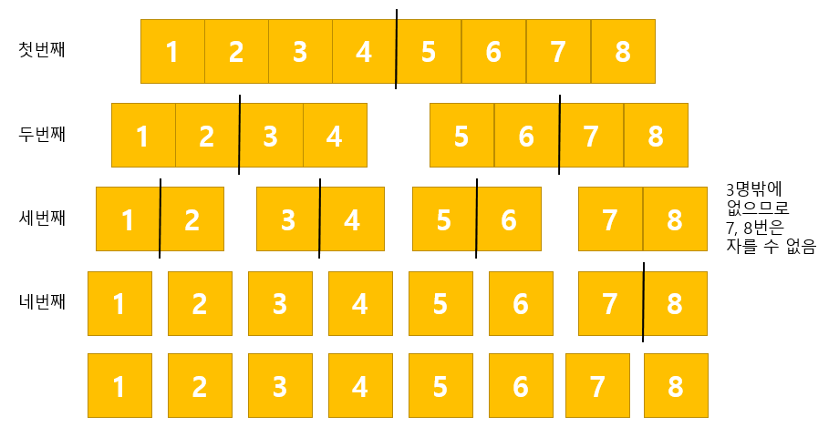

### 문제
길이 n[cm]의 한 막대를 1[cm] 단위로 자른다고 하고, 하나의 막대는 한 번에 한 사람만이 자를 수 있다.<br>
예를 들어 잘린 막대가 3개가 되면 동시에 3명이 자를 수 있다.<br>
최대 m명이 있다고 할 때<br><br>
n=20, m=3일 때의 횟수를 구해 보세요.<br>
n=100, m=5일 때의 횟수를 구해 보세요

<br>

### 예시

n=8, m=3일 때 아래와 같이 4번 자를 수 있다.<br><br>


<br>

### 문제풀이
```java

```
