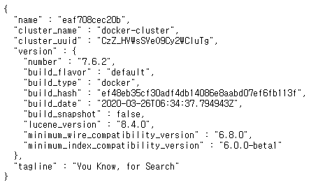
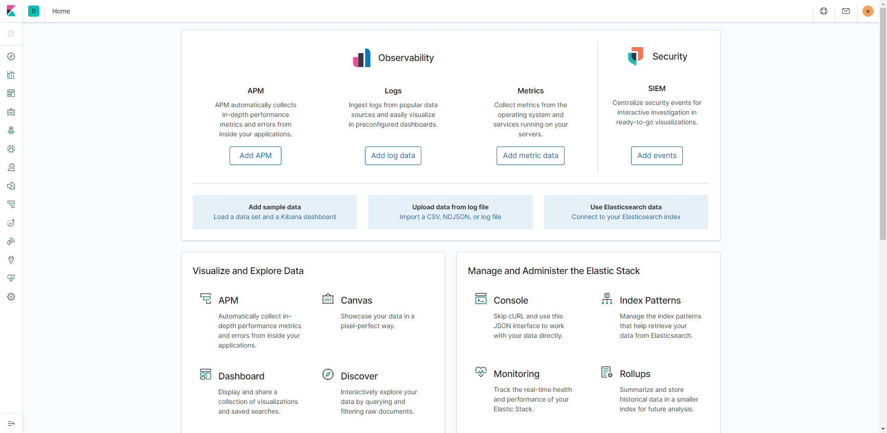

ELK (with Docker) 환경 설정
---

### 서버 port 확인

아래의 port를 열어준다<br>
```
5000(logstash)
9200(elasticsearch), 9300(elasticsearch)
5601(kibana)
```
<br>

### docker-compose 설치

```
curl -L https://github.com/docker/compose/releases/download/1.14.0/docker-compose-`uname -s`-`uname -m` > /usr/local/bin/docker-compose
chmod +x /usr/local/bin/docker-compose # 실행 권한 부여
```
<br>

### 프로젝트 다운로드

```
git clone https://github.com/deviantony/docker-elk.git
```
<br>

### docker-elk 폴더에 들어가서 환경 설정

xpack을 사용하지 않으므로 yml 수정<br>
<br>

vi docker-elk/elasticsearch/config/elasticsearch.yml
```
---
## Default Elasticsearch configuration from Elasticsearch base image.
## https://github.com/elastic/elasticsearch/blob/master/distribution/docker/src/docker/config/elasticsearch.yml
#
cluster.name: "docker-cluster"
network.host: 0.0.0.0

## X-Pack settings
## see https://www.elastic.co/guide/en/elasticsearch/reference/current/setup-xpack.html
#
#xpack.license.self_generated.type: trial
xpack.security.enabled: false
xpack.monitoring.collection.enabled: false
```

vi docker-elk/kibana/config/kibana.yml
```
---
## Default Kibana configuration from Kibana base image.
## https://github.com/elastic/kibana/blob/master/src/dev/build/tasks/os_packages/docker_generator/templates/kibana_yml.template.js
#
server.name: kibana
server.host: "0"
elasticsearch.hosts: [ "http://elasticsearch:9200" ]
#xpack.monitoring.ui.container.elasticsearch.enabled: true

## X-Pack security credentials
#
#elasticsearch.username: elastic
#elasticsearch.password: changeme
```

vi docker-elk/logstash/config/logstash.yml
```
---
## Default Logstash configuration from Logstash base image.
## https://github.com/elastic/logstash/blob/master/docker/data/logstash/config/logstash-full.yml
#
http.host: "0.0.0.0"
# xpack.monitoring.elasticsearch.hosts: [ "http://elasticsearch:9200" ]

## X-Pack security credentials
#
# xpack.monitoring.enabled: true
# xpack.monitoring.elasticsearch.username: elastic
# xpack.monitoring.elasticsearch.password: changeme
```

<br>

### docker-compose up

```
cd docker-elk
docker-compose build
docker-compose up -d
# -d : 백그라운드에서 실행 옵션)
# 종료할 땐 docker-elk 폴더 안에서 docker-compose down 하면 한번에 종료됨
```
<br>

### 실행화면

elasticsearch<br>


kibana<br>


<br>


참고<br>
https://setint.tistory.com/entry/%EC%9A%B0%EB%B6%84%ED%88%AC%EC%97%90%EC%84%9C-rpm-%EC%84%A4%EC%B9%98%EC%8B%9C-%EC%98%A4%EB%A5%98-%EB%82%A0-%EB%95%8C<br>
https://teichae.tistory.com/entry/Docker-Compose%EB%A5%BC-%EC%9D%B4%EC%9A%A9%ED%95%98%EC%97%AC-ELK-Stack-%EC%8B%9C%EC%9E%91%ED%95%98%EA%B8%B0-1<br>
https://soye0n.tistory.com/173<br>
https://discuss.elastic.co/t/kibana-server-is-not-ready-yet-kibana-7-6-2-new-install/227840/6<br>
https://hoonmaro.tistory.com/48<br>
https://woowabros.github.io/experience/2020/01/16/set-elk-with-alarm.html<br>