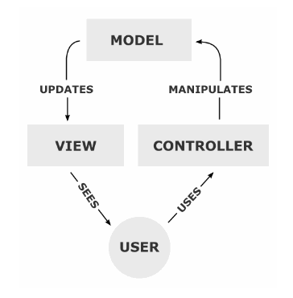

### 1\. WAS란?
 - 서버단에서 애플리케이션을 동작할 수 있도록 지원
 - Servlet 페이지를 HTML 형태로 변환(.jsp의 경우 WAS에서 java class 파일로 컴파일 후 html 형태의 페이지를 사용자에게 전달)
 - 동적인 페이지 처리

 

### 2\. WEB서버란?
 - 웹 클라이언트에게 콘텐츠를 제공하는 서버
 - CSS, Image 등의 리소스 파일을 가지고 있다가 WAS를 거치지 않고 사용자에게 직접 전달
 - 정적인 페이지 처리

 

### 3\. MVC 패턴이란?
- Model-View-Controller로 구성 

- 작동 순서
    - 사용자가 웹사이트에 접속
    - Controller는 사용자가 요청한 웹페이지를 서비스 하기 위해서 모델을 호출
    - 모델은 데이터베이스나 파일과 같은 데이터 소스를 제어한 후에 그 결과를 리턴
    - Controller는 Model이 리턴한 결과를 View에 반영
    - 데이터가 반영된 View는 사용자에게 보여짐

 

### 4\. 싱글톤 패턴이란?
 - 전역 변수를 사용하지 않고 객체를 하나만 생성 하도록 하며, 생성된 객체를 어디에서든지 참조할 수 있도록 만들어진 패턴
 - 최초 한번만 메모리를 할당하고 그 메모리에 객체를 만들어 사용하는 디자인 패턴